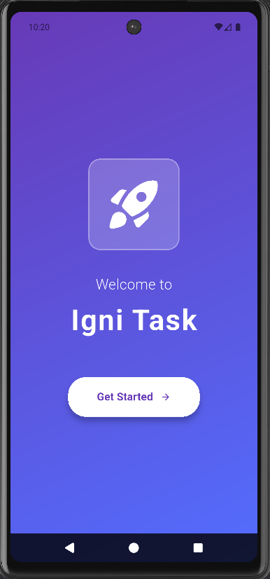
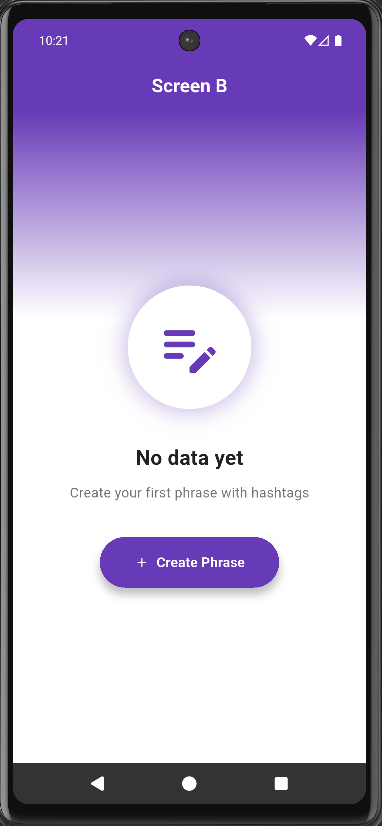
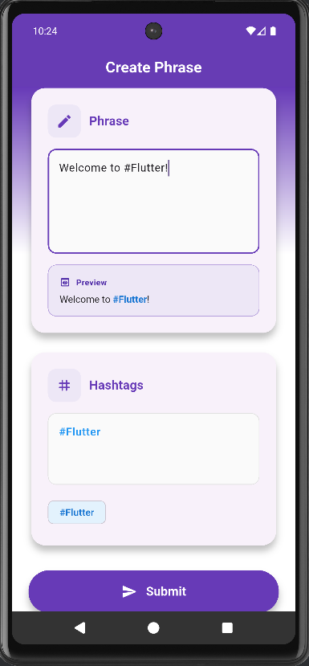
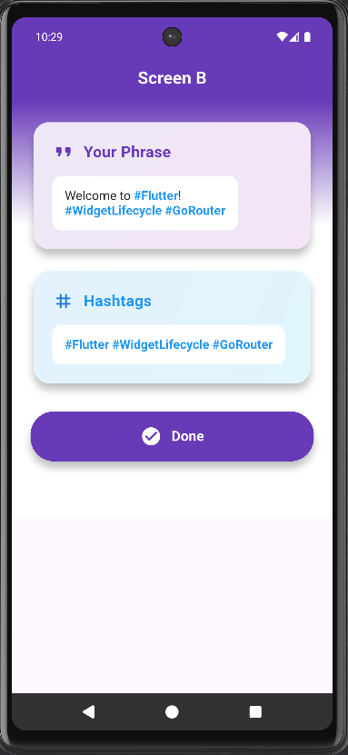

# Igni Task

A compact Flutter demo app for composing short phrases with hashtag extraction, previewing highlighted hashtags, and a simple multi-screen flow powered by `provider` and `go_router`.

---

## Table of Contents

- [About](#about)
- [Features](#features)
- [Screenshots](#screenshots)
- [Getting Started](#getting-started)
    - [Requirements](#requirements)
    - [Installation](#installation)
    - [Run](#run)
- [Project Structure](#project-structure)
- [Architecture & Patterns](#architecture--patterns)

---

## About

**Igni Task** is a minimal Flutter application demonstrating how to extract hashtags from user input, display a live preview with highlighted tags, and navigate through a simple three-screen flow. It emphasizes clean UI components and small reusable widgets.

---

## Features

- Compose multi-line phrases with `TextField`.
- Auto-extract hashtags from text and show them as chips.
- Live preview with highlighted hashtags using a custom `HighlightedText` widget.
- Simple multi-screen navigation using `go_router`.
- State management with `provider`.
- Reusable UI building blocks (cards, buttons, gradient background, dialog).

---

## Screenshots

<p align="center">
  
  
  
  
</p>
---

## Getting Started

### Requirements

- Flutter SDK (stable channel) — make sure your Flutter environment is setup.
- Dart (bundled with Flutter).
- A device or emulator to run the app.

### Installation

```bash
# clone the repo
git clone <repo-url>
cd <repo-folder>

# fetch dependencies
flutter pub get

# run on connected device / emulator
flutter run

```

## Project Structure
lib/
├─ main.dart
├─ router/
│  └─ app_router.dart
├─ providers/
│  └─ phrase_provider.dart
├─ ui/
│  ├─ screens/
│  │  ├─ screen_a.dart
│  │  ├─ screen_b.dart
│  │  └─ screen_c.dart
│  └─ widgets/
│     ├─ highlighted_text.dart
│     ├─ gradient_background.dart
│     ├─ rounded_card.dart
│     ├─ primary_button.dart
│     └─ ...other widgets
├─ utils/
│  └─ hashtag_extractor.dart

## Architecture & Patterns

- State management: provider (ChangeNotifier) — PhraseProvider holds the phrase and derived hashtags.
- Routing: go_router for declarative routes and custom transitions.
- UI: Screens composed from small reusable widgets to reduce boilerplate and improve readability.
- Hashtag extraction: Simple regex-based extractor in utils/hashtag_extractor.dart (keeps logic separate from UI).
